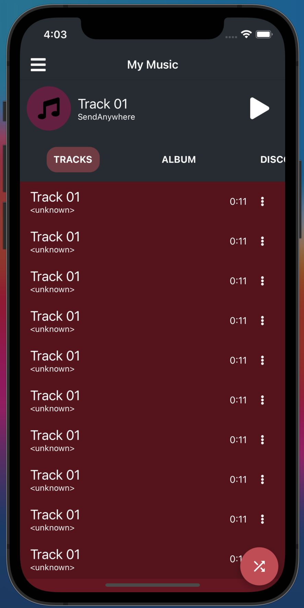
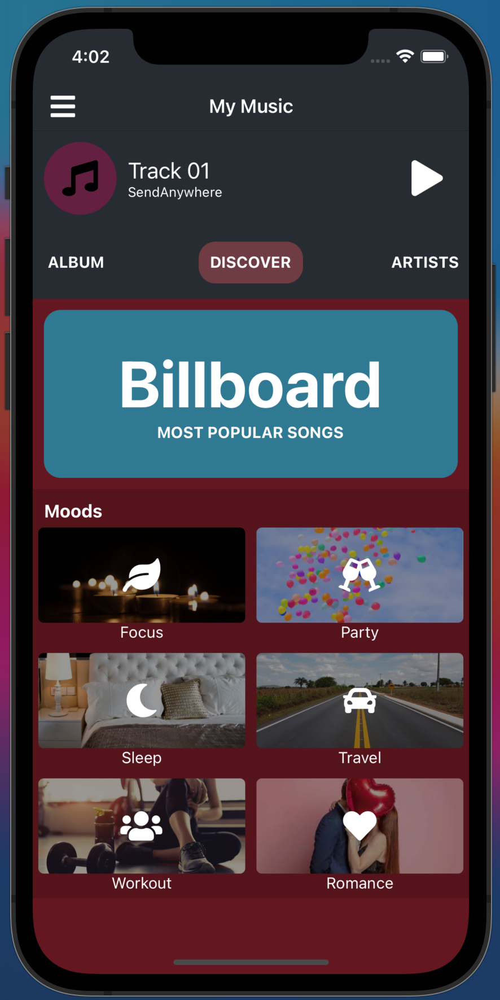
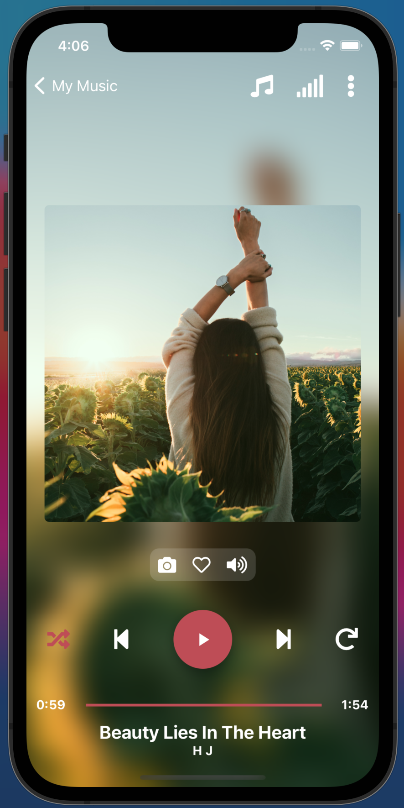
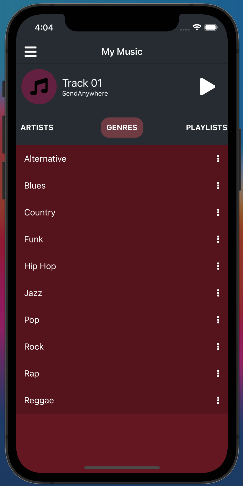
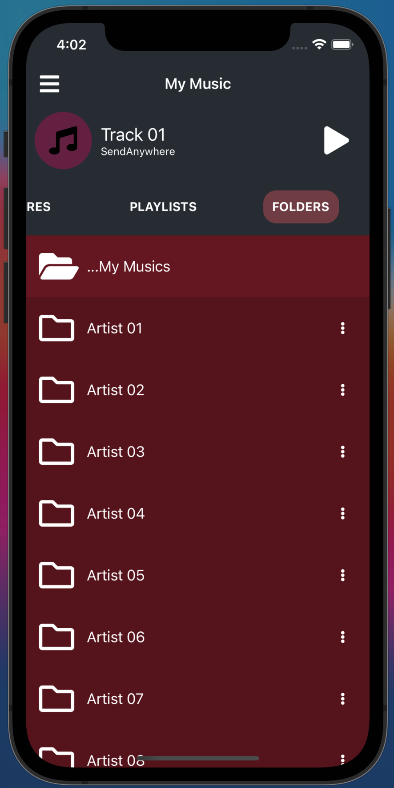

<p align="center">
  
</p>

<h1 align="center" style="font-weight: bold">MUSIC PLAYER APP</h1>

<p align="center">
A Music Player App builded with <b>React Native Paper</b> components
</p>

<p valign="top" align="center">
  
  
  
  
  
</p>

- TypeScript
- [React Native Paper](https://github.com/callstack/react-native-paper) components
- [React Navigation](https://reactnavigation.org/) (**v6**) for navigation.
- [React Native Vector Icons](https://github.com/oblador/react-native-vector-icons) for Icons


## DIRECTORY STRUCTURE
---

```
├───src
│   │   App.tsx
│   │   
│   ├───assets              contains resources
│   ├───components          contains components do be used on pages
│   ├───context             contains NoteContext
│   └───pages               contains pages
│
│  .buckconfig
│  .editorconfig
│  .eslintrc.js
│  .gitattributes
│  .gitignore
│  .prettierrc.js
│  .watchmanconfig
│  app.json
│  App.tsx
│  babel.config.js
│  index.js
│  metro.config.js
│  package.json
│  README.md
│  tsconfig.json
```

## Installation
---


```cmd
1. npm install or yarn install
2. cd ios && pod install
3. run application the app using one theses commands:
  2.1 npm run android or yarn android
  2.2 npm run ios or yarn ios
3. Done!
```

## Contributing
---

Pull requests are welcome. For major changes, please open an issue first to discuss what you would like to change.

Please make sure to update tests as appropriate.

## License
---

[MIT](https://choosealicense.com/licenses/mit/)